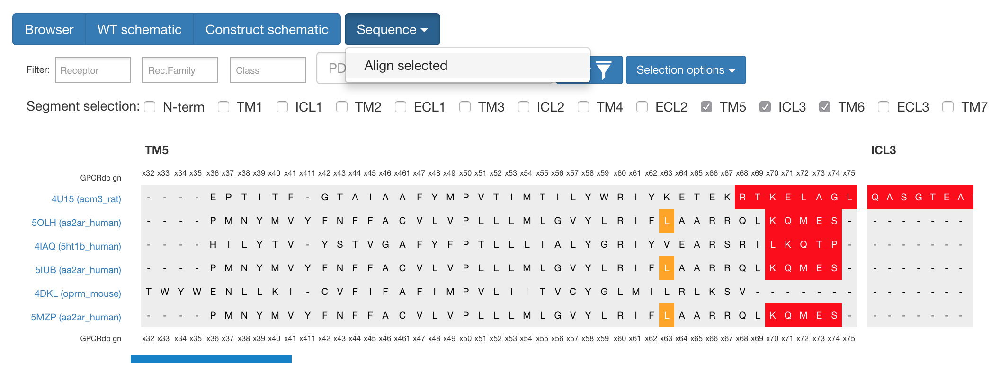
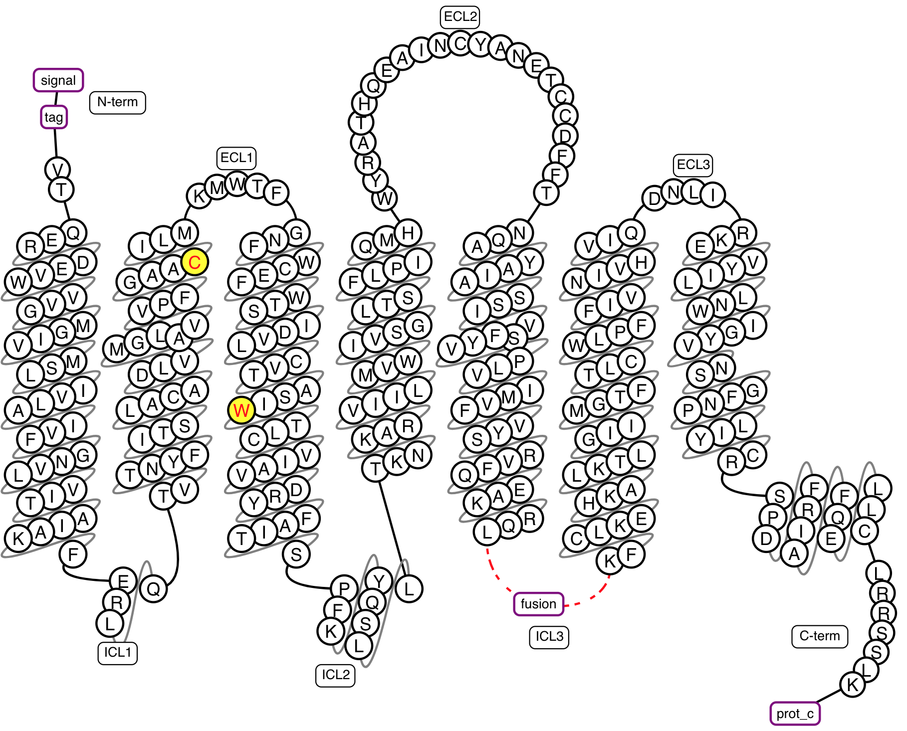
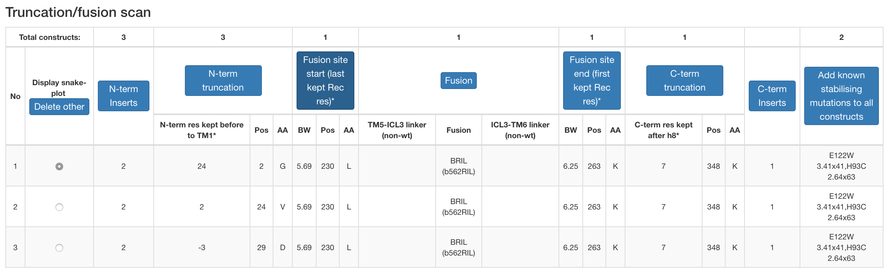

Structure Constructs
=================

Data
-----------------
Structure construct data was parsed from PDB files, which were fetched from RCSB PDB (www.rcsb.org). Deleted receptor regions were identified from the missing ranges in the DBREF lines. The PDB file protein sequence was matched to the wild-type sequence as a final validation of deletions and mutations. Residue annotations, including mutations, and additional protein sequences, such as linkers and fusion proteins, were imported from the SIFTS database49. Thereafter we fetched data on structure experimental values (resolution, crystal growth, r-factor and method) from the PDBe REST API (http://www.ebi.ac.uk/pdbe/api/pdb/entry/experiment/pdb_code), which also aided the manual annotation effort. We manually annotated a comprehensive collection of GPCR structure experiment methods and reagents from structure publications into a Microsoft Excel file, which was imported to GPCRdb. 

Furthermore, inserts not present in the final structure construct and therefore not available from the PDB and the effects of receptor mutations were also annotated and imported in the same way through separate spreadsheets. The completed integrated data can be retrieved at the GPCRdb repository (https://github.com/protwis/gpcrdb_data/tree/master/structure_data/construct_data).

Construct alignments
-----------------
Construct alignments allow for quickly browse different constructs. There are three main views:
1. Browser -- In a table format it allows for quickly sorting and filtering the dataset. Upon sorting/filtering it is possible to switch back to the schematic views with the subset of data. 
2. WT (Wild-type) schematic -- This view takes the perspective of the wild-type sequence so it becomes clear to see what parts of the proteins have been deleted and mutated.
3. Construct schematic (default view) -- This view show the final construct schematic -- here additional inserts are shown (Signal-tags, cleaveage tags, fusion proteins).

Furthermore, there are filter options on all views where you can filter by several options to narrow the view to the structures of main interest.

If one wants to analyse the sequences themselves, it is possible to select several constructs and segments and with the "Sequence" button align these to get view shown below.

    **Figure 1**. What can be seen here is the alignment around TM5 / ICL3 segments to compare cut-sites among different constructs.

Construct design tool
-----------------

    **Figure 2**. Example snakeplot representation of a construct under construction.

When using the Construct design tool on a target receptor, the user first selects whether the construct is intended to produce an active or inactive state structure, and optionally where a fusion protein should be inserted. This selection affects the tools design for the given target by only using as a basis the data that were obtained from templates with the same state and region of fusion. 
For all types of construct modifications the presented suggestions are ranked by target-template homology levels: same receptor, receptor family, or class or a different class (B2 to B1 and Taste 2 receptors to A). Whereas the homology is the default sorting for all types of construct modifications, for targets without a clear closest template users also have the option to instead sort by the frequency that a given modification has been observed among all unique receptors. N- and C-terminal truncation: To allow for cross-receptor comparisons, the lengths of N- and C-termini are defined as the number of residues that have been preserved before the start of the first transmembrane helix (TM1) and after the end of helix 8 (H8), respectively. 
Data from N-terminal protein fusions, with e.g. T4L or BRIL, are excluded unless the user has selected a fusion in this region. Fusion protein sites: Reflecting the structures obtained hitherto, loop fusions are placed in the second and third intracellular loops for the classes B and C, and A and F, respectively using the GPCRdb generic residue numbering scheme. If the user did not select a loop fusion, long ICL3 loops (>8 residues) are instead assigned suggestions of deletion sites from non-fused and N-terminally fused constructs.

The suggestions of stabilising mutations span a number of specific design rules (http://files.gpcrdb.org/mutation_rules.html) which are both data- and rationale-driven and cover five overall concepts: 

1.  Homology: This concept infers a mutant position and amino acid if the target is the same receptor or a member of the same receptor family. For the classes B-F, which are smaller and have less data than class A, mutations will also be informed from any member of the same class.

2.  Common mutations: These are mutations that have been utilised within several distinct receptor families, but not yet that of the selected receptor target.

3.  Conservation: This concept introduces residues that are missing in the target but at least 70% conserved in the receptor family or class. For the positively charged residues H, K and R a lower, 40% conservation is used in order to incorporate multiple position at the tips of the transmembrane helices wherefrom these residues can interact with the polar head groups of the cell membrane. Furthermore, the low-propensity residues G and P are treated separately (below) and cysteine, which can form disulphide bridges, is excluded.

4.  Helix propensity: This concept increase helix propensity by replacing Proline and Glycine residues that are present in the target receptor but poorly conserved in the receptor family or class with Alanine. Glycine residues within four positions from a helix end are preserved, as they can be crucial for the transition to a loop structure. 

5.  State switches: These residues form interactions that are unique for either inactive or active receptor states. The state selected by the user will be targeted by adding and removing residues with such interactions.

    **Figure 3**. Example design table for a construct under construction.

**Using the Construct Design Tool**

We have three seperate applications modes, as listed below.

1.  Truncation/fusion scan (generates constructs covering all the unique combinations of user-selected truncations and/or fusions).

2.  Mutation scan (first designs one reference construct –which can include mutations with known stabilising effect–  and then selects a number of stabilising mutations which are individually added to generate as many constructs).

3.  Custom constructs (constructs are designed one at the time by repeated custom selection of truncations, fusions and mutations).

The two scanning applications, i.e. 1-2, contain the option to automatically select a given number of top ranking suggested truncations/fusions and mutations, respectively. For all three applications it is possible to edit the generated table of constructs, i.e. modify or remove an existing or add a new construct.

Experiment browser
-----------------
The experiment browser shows all the annotated experimental values for constructs. Since there are so many it is possible to toggle the visiblity of several types of data (Expression, Solubilization, Purification and Structure determination). Similarly to other views, it is possible to filter by almost any column to narrow down the dataset to the most relevant. 

Truncation & Fusion analysis
-----------------
These pages are used for detailed analysis for different key features for construct design. It shows the distribution of differnet cut sites in N-term, C-term and the loops (with and without fusion proteins).

Mutation analysis
-----------------
We have three pages for mutation analysis in relation to construct structures.

**Mutation Browser** Is our manually annotated structure mutations which notes whether a mutation has an effect on thermostability, receptor expression and many other features. As with most of our views it is possible to filter and sort by most columns.

**StaMutAnalyser** (Stabilising Mutation Analyser) Is a tool developed to analyse mutations that cover several receptor to help determine their rationale. Whether the site is known to participate in either Ligand-binding, Arresting-binding or G-protein-binding can be seen to the right most columns with a count of distinct receptors known to have an interaction at a given position. Functional sites, such the Sodium Ion site, is also annotated to correlate that with the mutation.

**Mutation substitution matrix** shows the frequencies (no. GPCRs) of thermostabilising mutant amino acid substitutions across all positions of the receptor sequences/structures.
