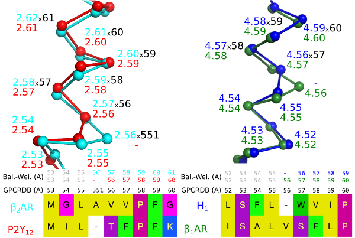

Generic residue numbering
=========================

Sequence-based generic GPCR residue numbering schemes\ :superscript:`1` exist for class A
(Ballesteros-Weinstein, BW\ :superscript:`2` \) B (Wootten\ :superscript:`3` \), C (Pin\ :superscript:`4` \), and F
(Wang\ :superscript:`5` \). In these systems, the first number denotes the helix (1-7) and the second the residue
position relative to the most conserved position, which is assigned the number 50. For example, 6.51 denotes
a residue in transmembrane helix 6, one position after the most conserved residue (6.50). The reference
helix conserved positions differ between the GPCR classes.

Recent GPCR crystal structures have revealed frequent helix bulges and constrictions in several
transmembrane helices\ :superscript:`6` \. Structural superimposition makes it clear that these cause a gap that
offsets all the following residue numbers when compared to an undistorted helix, i.e. the structurally equivalent
residues no longer have the same number (Fig. 1).

    **Figure 1**. A bulge in helix 2 of the Beta-2 adrenergic receptor (left) and a
    constriction in helix 4 of the Histamine H1 receptor (right) create offsets in the
    sequence-based generic numbers when compared to receptors that lack the bulge/constriction.

The GPCRdb numbering scheme\ :superscript:`1` is the first that is based on crystal structures and corrects for
helix bulges and constrictions. GPCRdb numbers are distinguished by a unique separator x and may be used
alone, e.g. 5x47, or together with one of the sequence-based schemes, e.g. 5.46x47. A bulge residue is
assigned the same number as the preceding residue followed by a 1, e.g. 551 for a bulge following
position 55.

GPCRdb offers a suite of tools making it easier to use generic residue numbers:

* Structure-based `sequence alignments <http://gpcrdb.org/alignment/targetselection>`_ gapped to account for bulges and constrictions
* `Lookup tables <http://gpcrdb.org/residue/residuetable>`_ with receptor-specific and generic residue numbers
* `PDB structure numbering <http://gpcrdb.org/structure/generic_numbering_index>`_ along with visualization tools for PyMOL and Maestro

GPCRdb cross-class alignments contain each of the numbering schemes, which may be distinguished in text
by appending the letter of the class, e.g. 2x52ax59b. The Lookup tables tool also provides the alternative
class A numbering schemes by Oliveira\ :superscript:`7` and Baldwin/Schwartz\ :superscript:`7,8` \.

**References**

#. `V Isberg et al. <http://dx.doi.org/10.1016/j.tips.2014.11.001>`_, **2015**, *Trends Pharmacol Sci*, 36(1), 22–31.
#. `JA Ballesteros and H Weinstein <http://dx.doi.org/10.1016/S1043-9471(05)80049-7>`_, **1995**, *Methods Neurosci*, 25, 366–428.
#. `D Wootten et al. <http://dx.doi.org/10.1073/pnas.1221585110>`_, **2013**, *Proc Natl Acad Sci*, 110(13), 5211-5216.
#. `J-P Pin et al. <http://dx.doi.org/10.1016/S0163-7258(03)00038-X>`_, **2003**, *Pharmacol Ther*, 98(3), 325-354.
#. `C Wang et al. <http://dx.doi.org/10.1038/ncomms5355>`_, **2014**, *Nat Commun*, 5, 4355.
#. `R van der Kant and G Vriend <http://dx.doi.org/10.3390/ijms15057841>`_, **2014**, *Int J Mol Sci*, 15(5), 7841-7864.
#. `L Oliveira et al. <http://dx.doi.org/10.1007/BF00125323>`_, **1993**, *J Comput Aided Mol Des*, 7(6), 649–658.
#. `JM Baldwin <http://www.ncbi.nlm.nih.gov/pmc/articles/PMC413383>`_, **1993**, *EMBO J*, 12(4), 1693–703.
#. `TW Schwartz <http://dx.doi.org/10.1016/0958-1669(94)90054-X>`_, **1994**, *Curr Opin Biotechnol*, 5(4), 434–44.