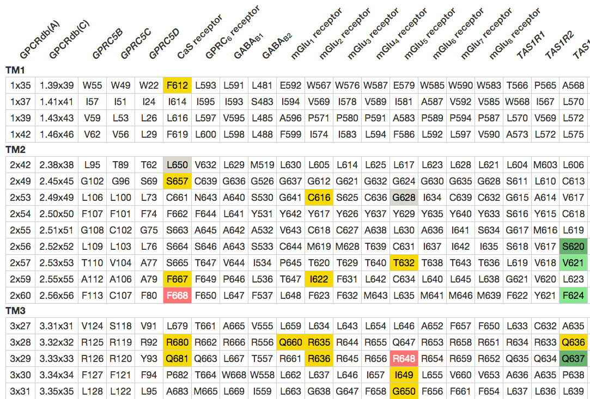
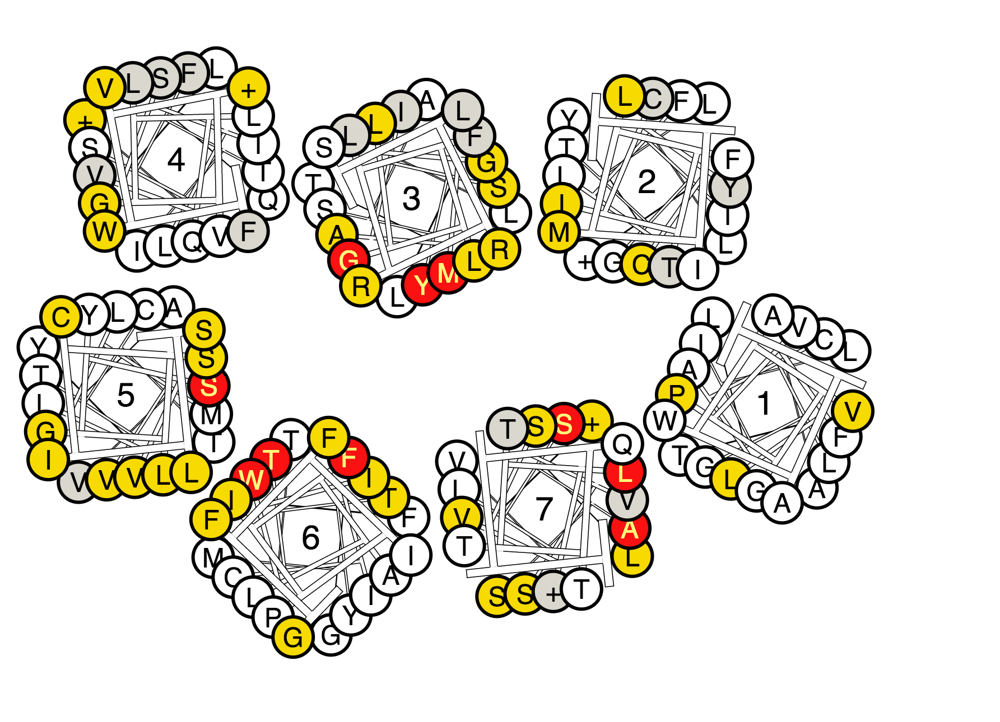
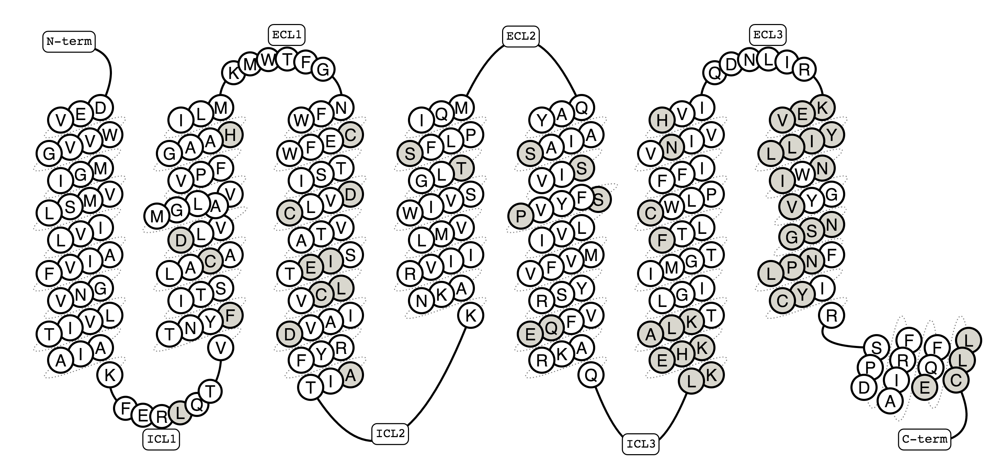

Mutations
=========

Mutation browser
----------------

The mutant browser allows users to view mutant data for a receptor or receptor family and hightlight mutants on
receptor diagrams. Using the tool is a two step process.

1.  The user is first presented with a receptor selection page. Receptors can be selected individually or by family.
    The user can select as many receptors as he/she wishes (WARNING: selecting a large number of receptors increases
    loading time).
2.  After receptors have been selected, the user is presented with a sequence segment selection page. The user can
    select one or more sequence segments, and/or expand each segment to select the residues within it individually.
    Residues selected individually are grouped into a custom sequence segment.

The results page shows a table of mutants for the selected receptors and segments. The table can be ordred and filtered
by each column.

Below the table, helix box and snake plots are shown, with the mutated residues highlighted. The
sequence in the plots is the consensus sequence of the selected receptors.

Below the plots, a table of every residue in the selected receptors and segments is shown, with the mutated residues
highlighted.

Mutation data submission
------------------------

The GPCRdb already contains the largest available set of GPCR mutants and the goal is to continuously deposit mutants
into GPCRdb, now also capturing the pharmacological effect.

You can contribute to the mutational data available in GPCRdb, e.g. with data from your own lab to increase the
visibility and thus the number of citations. You can also contribute with data sets gathered from the literature, which
can be put into perspective by comparing to mutational effects in e.g. other GPCR subtypes by use of the visualization
tools available in GPCRdb. To capture mutational data in a format that enables comparison of effect on e.g. ligand
binding affinity, a standardized Excel spreadsheet has been prepared to collect the data. `Please download it here`_,
enter your data by following the instructions included in each cell and email the file to Kasper Harpsøe (kasper.harpsoe@sund.ku.dk).

A few examples of entered mutant data are `available here`_ and if in doubt please contact Kasper Harpsøe (kasper.harpsoe@sund.ku.dk) via
e-mail.

.. _Please download it here: http://files.gpcrdb.org/excel_file_for_reporting_mutants.xlsx
.. _available here: http://files.gpcrdb.org/excel_file_for_reporting_mutants_examples.xlsx
.. _Kasper Harpsøe: mailto:kasper.harpsoe@sund.ku.dk

Type of mutation data
^^^^^^^^^^^^^^^^^^^^^

The current standardized Excel spreadsheet is made for reporting mutational effects on ligand binding and function but
additionally contains the possibility to report mutational effect on surface expression, basal activity and Emax.

Future plans for the GPCRdb mutational database includes the possibility to receive and display data for mutations with
effect on thermo-stabilization, biased signaling, G-protein binding and dimerization and more may be added.

How will the mutation data be used?
^^^^^^^^^^^^^^^^^^^^^^^^^^^^^^^^^^^
The mutant browser allows users to browse and search the mutation database for e.g. mutations in a given
receptor or sub-family of receptors, mutations in a given generic numbering position, mutations with effect on a given
ligand or ligand class (and much more). It is also possible to download the mutation data of interest.

Our main focus is on how mutants affect ligand binding and function. Thus, the first visualization tools that are
available in the GPCRdb are snake and helix box diagrams for mapping mutated residues on the 7TM domain plus tables
for comparing mutated residues across receptor subtypes. Both diagrams and tables can be color-coded according to the
fold-effect of the mutation on the desired ligand property (binding or effect – see examples). It is also possible to
combine the diagrams and table with information on ligand-interacting residues annotated from experimental structures
to give a structural explanation for the observed mutational effect. Furthermore, it is the intention that future
versions of GPCRdb tools will additionally offer mapping of mutational data on crystal structures and homology models
in 3D.

    **Figure 1**. Sequence comparison of the 7TM domain binding pocket in the eight mGlu receptor subtypes with all
    residues that have been mutated. Color-coding: Green indicates increased binding/potency of >5-fold (light green)
    or >10-fold (dark green), red indicates reduced binding/potency of >5-fold (pink) or >10-fold(red), yellow
    indicates No/low effect (<5-fold), and grey indicates that no effect is annotated. The first two columns show
    :doc:`generic GPCRdb residue numbers <generic_numbering>` for each row of residues.
    

    **Figure 2**. A helix box diagram of the metabotropic glutamate receptors displaying mutated residue positions from
    the extracellular side with all residues that have been mutated. Color-coding: Green indicates
    increased binding/potency of >5-fold (light green) or >10-fold (dark green), red indicates reduced binding/potency
    of >5-fold (pink) or >10-fold(red), yellow indicates No/low effect (<5-fold), and grey indicates that no effect
    is annotated.

    **Figure 3**. Snake  diagram of the human β\ :subscript:`2` \-adrenoceptor showing all residues (grey) for which
    mutational experiments have been deposited in the GPCRdb.

